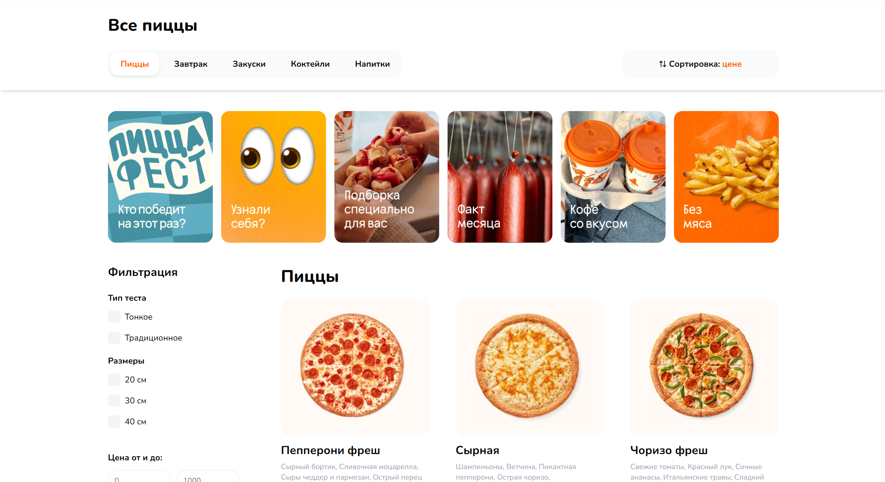
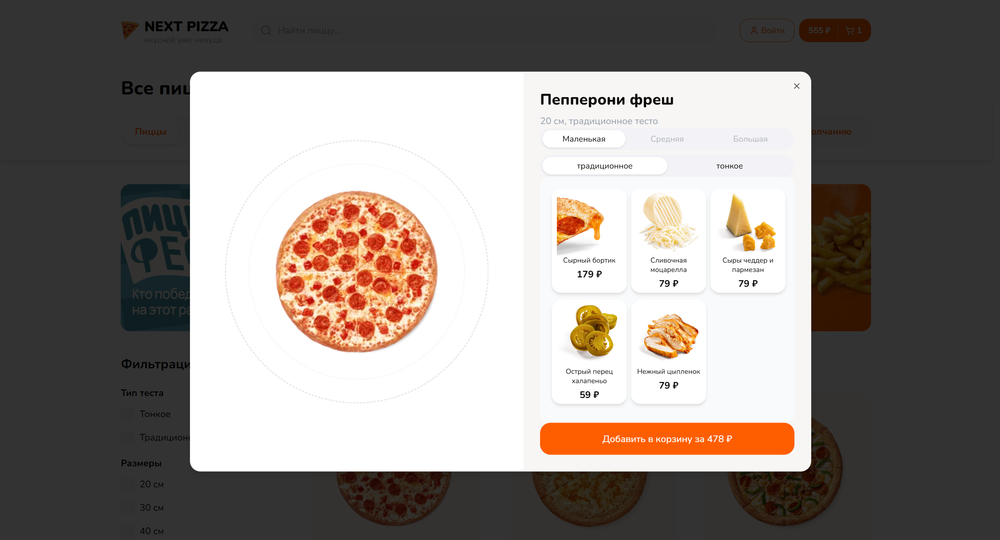
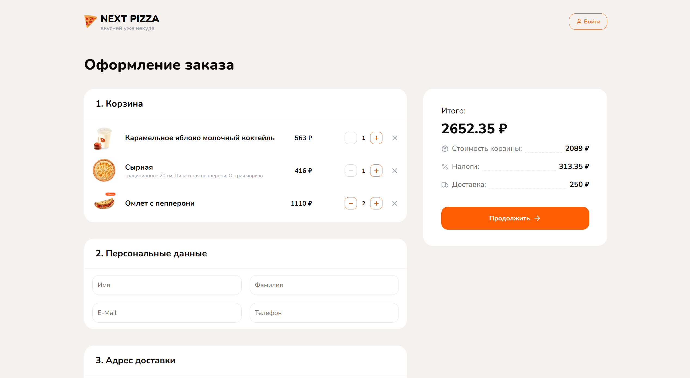

# 🍕 Next Pizza — FullStack E-commerce Platform

Next Pizza is a modern FullStack online store inspired by the Dodo Pizza chain. The project is built with cutting-edge technologies, utilizing server components and modern design patterns.

---

## 🌐 Live Demo

- **Live App (Frontend):** [fullstack-next-pizza.vercel.app](fullstack-next-pizza.vercel.app)

---

## 🚀 Technical Highlights

### FullStack Architecture on Next.js 14

- **App Router:** Leveraging the latest Next.js routing paradigm
- **Parallel Routes:** For product modal windows
- **Group Routes:** For clean code structure and organization

### Flexible Product Filtering

- **Server-Side Rendering (SSR):** All filtering happens on the server
- **URL Synchronization:** Filter parameters are synced with the URL, allowing users to share specific search results

### Complex Database Design (Prisma ORM)

- **Relational Modeling:** One-to-One, One-to-Many, and Many-to-Many relationships
- **Entities:** Ingredients, Products, Carts, and Orders with proper associations

### State Management (Zustand)

- **Global State:** Cart management, search functionality, and user sessions
- **Efficient Updates:** Optimized re-renders and data synchronization

### NextAuth v5

- **Multi-Provider Authentication:** Google, GitHub, and traditional email/password
- **Email Verification:** Account confirmation via Resend service

### Payment System

- **LiqPay Integration:** Transaction processing
- **Webhooks:** Real-time order status updates

---

## 🛠 Tech Stack

| Category               | Technologies                                 |
| ---------------------- | -------------------------------------------- |
| **Framework**          | Next.js 14 (App Router), TypeScript          |
| **UI & Styling**       | TailwindCSS, ShadCN UI, Lucide Icons         |
| **Database**           | PostgreSQL, Prisma ORM                       |
| **State Management**   | Zustand, react-use                           |
| **Forms & Validation** | React Hook Form, Zod                         |
| **Auth & Security**    | NextAuth, Argon2 (hashing)                   |
| **Services**           | Resend (Emails), Yookassa (Payments), Vercel |

---

## 📸 Interface Preview



### Product Modal (Parallel Routes)



### Cart & Checkout



## 🏗 Project Features

### 🔍 Search and Filtering

- **Instant Search:** Real-time product search
- **Advanced Filters:** Price range, ingredients, dough types

### 🛒 Shopping Cart

- **Full CRUD Operations:** Add, remove, update quantities
- **Client-Server Sync:** Persistent cart state synchronized with database

### 📝 Checkout Process

- **Form Validation:** Powered by Zod
- **Address Selection:** User-friendly address input
- **Payment Integration:** Secure payment processing

### 📱 Stories System

- **Instagram-Style Stories:** Promotional content display
- **Implementation:** Built with react-insta-stories

### 👤 User Profile

- **Profile Editing:** Update personal information
- **Order History:** View past orders and their statuses

### 📧 Email Notifications

- **Automated Emails:** Sent during registration, order creation, and successful payment
- **Service:** Powered by Resend

---

## 📂 Installation and Setup

### 1. Clone the Repository

```bash
git clone https://github.com/your-username/next-pizza.git
cd next-pizza
```

### 2. Install Dependencies

```bash
npm install
# or
yarn install
# or
pnpm install
```

### 3. Database Migrations

```bash
npx prisma db push
npx prisma db seed  # Populate with test data
```

### 4. Run the Development Server

```bash
npm run dev
# or
yarn dev
# or
pnpm dev
```

Open [http://localhost:3000](http://localhost:3000) to view the application.

---

## 🎯 Key Learnings

During the development of this project, the following concepts were mastered:

- **Server Actions:** Implementing Next.js server-side mutations
- **Rendering Optimization:** Understanding client vs server component rendering
- **Parallel/Group Routes:** Advanced routing patterns in Next.js
- **Real-World Database Design:** Complex relational schemas with Prisma
- **Payment Integration:** Webhook handling and transaction processing
- **Email Automation:** Transactional email workflows

---

## 🎓 Credits

This project was developed based on the tutorial from **Archakov Blog**.

Special thanks to the creator for providing comprehensive guidance on modern Next.js development practices.

---

## 📄 License

This project is open-source and available under the MIT License.

---

## 👤 Author

**Andrew**

- [GitHub Profile](https://github.com/maybelaber)
- [LinkedIn](https://linkedin.com/in/andrii-borysov-9945bb3aa/)
